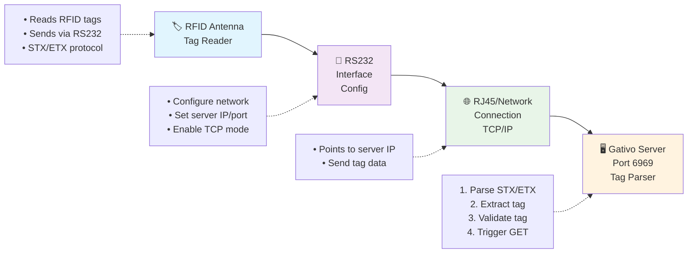
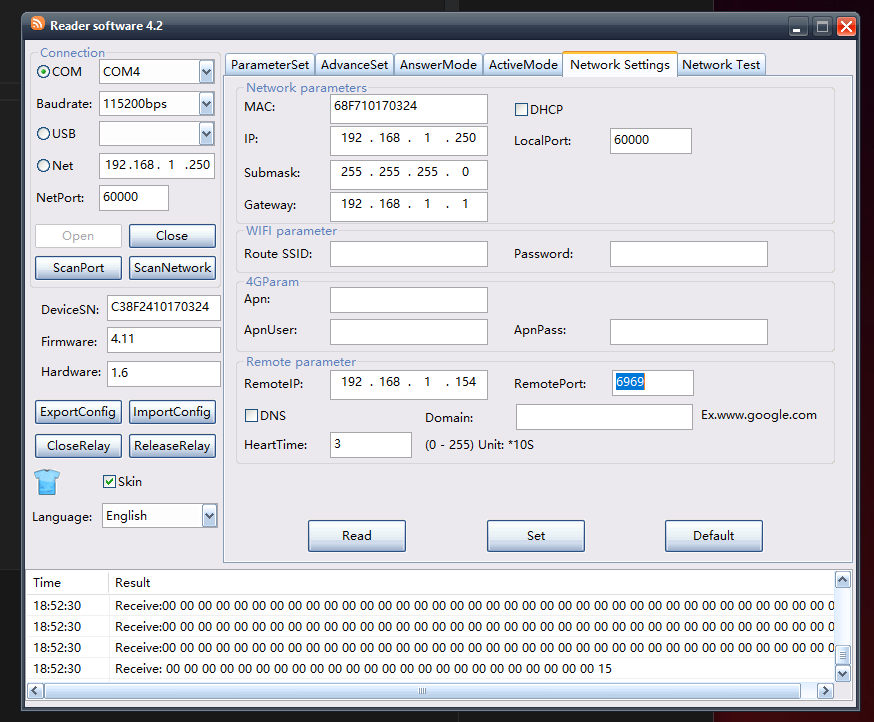
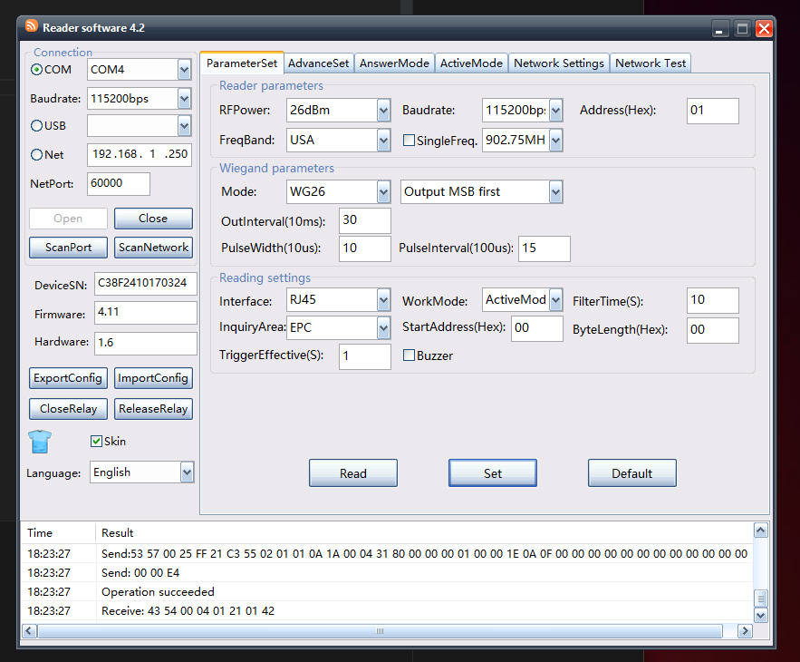
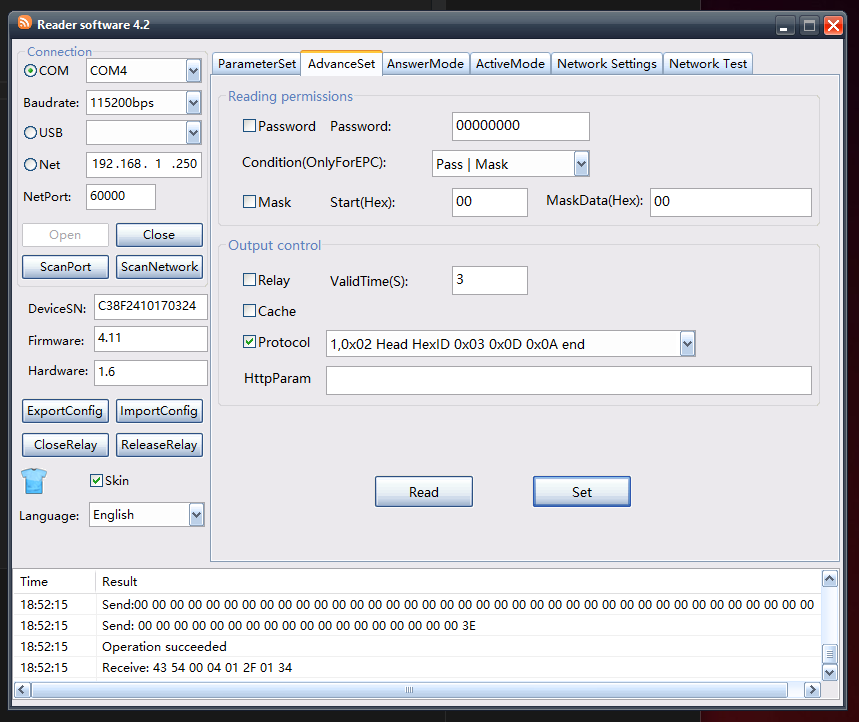

# Gativo - RFID TCP Server

A lightweight, modular Node.js server for processing RFID tag data via TCP connections. Validates tags against a remote database and triggers webhooks for approved tags with built-in debounce protection.

## 🚀 Features

- **TCP Server** - Receives RFID data using STX/ETX protocol on port 6969
- **Tag Validation** - 1:1 exact matching against remote approved tags database  
- **Webhook Triggers** - HTTP GET requests to configured endpoints for approved tags
- **Debounce Protection** - Prevents duplicate triggers within configurable time window
- **Auto-Refresh** - Periodically updates approved tags from remote endpoint
- **Memory Management** - Automatic cleanup of old tracking records
- **Error Resilience** - Graceful error handling and recovery
- **Modular Design** - Clean, maintainable architecture with single responsibility modules

## 📁 Project Structure

```
├── rfid-server.js          # Main server entry point
├── rfid-server-old.js      # Original monolithic version (backup)  
├── server.py              # Original Python implementation
├── package.json           # Dependencies and scripts
├── .env                   # Environment configuration
└── src/                   # Modular components
    ├── config.js          # Environment configuration management
    ├── network-utils.js   # Network utilities (IP detection, client formatting)
    ├── http-client.js     # HTTP client for API calls
    ├── debounce-manager.js # Tag debouncing logic
    ├── rfid-protocol.js   # STX/ETX protocol parsing
    └── tag-database.js    # Approved tags database management
```

## ⚡ Quick Start

### Installation

```bash
# Clone the repository
git clone <repository-url>
cd gativo

# Install dependencies
npm install

# Configure environment
cp .env.example .env
# Edit .env with your endpoints
```

### Configuration

Set these environment variables in `.env`:

```env
# Required endpoints
TAGS_DB_ENDPOINT="https://api.example.com/approved-tags"
TRIGGER_ENDPOINT="https://api.example.com/tag-detected"  

# Default approved tags (merged with endpoint + used as fallback)
DEFAULT_APPROVED_TAGS=["1234567890", "0987654321"]

# Tag database auto-update configuration
TAGS_DB_AUTOUPDATE=true                  # true/false - enable/disable auto-refresh
TAGS_DB_UPDATE_FREQUENCY=5               # minutes - how often to refresh from endpoint

# Timing configuration (optional - defaults shown)
DEBOUNCE_MINUTES=5
REQUEST_TIMEOUT_SECONDS=5
```

## 📡 Antenna Setup & Configuration

### Hardware Connection Flow



### Antenna Configuration Screenshots

Configure your RFID antenna with these settings to connect to the Gativo server:

#### 1. Network Settings
Configure the antenna to point to your server's IP address and port 6969:



#### 2. Parameter Settings  
Set up the basic communication parameters:



#### 3. Advanced Settings
Configure advanced protocol and connection settings:



### Setup Steps

1. **Connect Antenna** - Connect RFID antenna via RS232 interface
2. **Configure Network** - Set server IP address and port 6969 in antenna settings
3. **Enable TCP Mode** - Ensure antenna is configured for TCP/IP communication  
4. **Set Protocol** - Configure STX/ETX protocol for tag transmission
5. **Test Connection** - Verify antenna can reach server IP/port
6. **Start Server** - Run `npm start` to begin receiving tag data

### Troubleshooting

- **Connection Failed**: Check network connectivity between antenna and server
- **No Tag Data**: Verify STX/ETX protocol is enabled on antenna
- **Wrong Port**: Ensure antenna is configured to send data to port 6969
- **IP Issues**: Confirm server IP address matches antenna configuration

### Running

```bash
# Start the server
npm start

# The server will display:
# 🚀 RFID Server listening on 192.168.x.x:6969
# 📊 Loaded X approved tags
# ⏱️  Tag debounce set to 5 minutes
```

## 🔧 How It Works

### Tag Database Management
- **Default Tags** - Loaded from `DEFAULT_APPROVED_TAGS` at startup
- **Auto-Update** - Configurable refresh from endpoint (on/off + frequency)
- **Smart Merging** - Remote tags merged with defaults on each update  
- **Fallback Protection** - Uses defaults if endpoint fails or is unavailable
- **Exact Matching** - Only accepts perfect 1:1 tag ID matches

### Processing Pipeline
1. **TCP Connection** - RFID readers connect to port 6969
2. **Protocol Parsing** - Extracts tag IDs from STX/ETX binary protocol  
3. **Tag Validation** - Checks if tag exists in approved database (exact match)
4. **Debounce Check** - Prevents duplicate triggers within time window
5. **Webhook Trigger** - Makes GET request to configured endpoint for approved tags

### Example Flow

```
🔌 Connected: 192.168.1.50:12345
🏷️  ABC123456789
✅ APPROVED TAG DETECTED: ABC123456789
🚀 Triggering endpoint for approved tag: ABC123456789
✅ Trigger response (200): {"success": true, "tag_id": "ABC123456789"}
--break--

🏷️  ABC123456789  (scanned again immediately)
⏱️  Tag ABC123456789 debounced (4m remaining)
--break--
```

## 🌐 API Integration

### Approved Tags Endpoint

Your `TAGS_DB_ENDPOINT` should return a JSON array:

```json
["TAG001", "TAG002", "ABC123456789", "DEF987654321"]
```

### Trigger Endpoint

When an approved tag is detected, a GET request is made:

```
GET https://api.example.com/tag-detected?tag=ABC123456789
```

## 🛠️ Development

### Module Overview

- **`config.js`** - Centralized environment configuration
- **`network-utils.js`** - IP detection and client address formatting
- **`http-client.js`** - HTTP requests with timeout and error handling
- **`debounce-manager.js`** - Tag timing logic and cleanup
- **`rfid-protocol.js`** - STX/ETX binary protocol parsing
- **`tag-database.js`** - In-memory approved tags management

### Code Examples

```javascript
const config = require('./src/config');
const tagDatabase = require('./src/tag-database');

// Get server configuration
console.log(config.server.port); // 6969

// Check if tag is approved
console.log(tagDatabase.isApproved('TAG001')); // true/false

// Get database stats
console.log(tagDatabase.getStats());
```

### Testing with Old Version

```bash
# Run simplified version (default)
npm start

# Run original monolithic version for comparison  
npm run start:old
```

## 🏗️ Architecture Benefits

- **Lean & Fast** - Only essential features, ~490 lines total
- **Single Responsibility** - Each module has one clear purpose
- **Maintainable** - Easy to modify specific functionality  
- **Testable** - Modules can be unit tested in isolation
- **Production Ready** - Error handling, graceful shutdown, memory management

## 📊 Performance

- **Memory Efficient** - In-memory Set for O(1) tag lookups
- **Auto-Cleanup** - Removes old debounce records every 10 minutes
- **Minimal Dependencies** - Only `dotenv` required
- **Low Latency** - Direct TCP connections, no HTTP overhead

## 🔒 Production Deployment

### Environment Variables

```env
# Required
TAGS_DB_ENDPOINT="https://your-api.com/approved-tags"
TRIGGER_ENDPOINT="https://your-api.com/tag-detected"

# Optional
DEBOUNCE_MINUTES=5  # Default: 5 minutes
```

### Process Management

```bash
# Using PM2 (recommended)
npm install -g pm2
pm2 start rfid-server.js --name "gativo-rfid"
pm2 startup
pm2 save

# Using systemd
sudo systemctl enable gativo-rfid.service
sudo systemctl start gativo-rfid.service
```

### Monitoring

The server provides detailed console logging for monitoring:

```
🚀 RFID Server listening on 192.168.1.100:6969
📋 Loading approved tags database...
✅ Loaded 42 approved tags
🔌 Connected: 192.168.1.50:12345
🏷️  ABC123456789
✅ APPROVED TAG DETECTED: ABC123456789
🚀 Triggering endpoint for approved tag: ABC123456789
```

## 🤝 Contributing

1. Fork the repository
2. Create a feature branch (`git checkout -b feature/amazing-feature`)
3. Commit your changes (`git commit -m 'Add amazing feature'`)
4. Push to the branch (`git push origin feature/amazing-feature`)
5. Open a Pull Request

## 📝 License

This project is licensed under the MIT License - see the [LICENSE](LICENSE) file for details.

## 🆚 Evolution

This project evolved from:
- **Python TCP Server** (`server.py`) - Original implementation
- **NestJS Version** (removed) - Over-engineered framework approach  
- **Monolithic Node.js** (`rfid-server-old.js`) - Single file version
- **Modular Node.js** (`rfid-server.js`) - Current clean architecture

The current version provides the same functionality with better maintainability and significantly reduced complexity.
