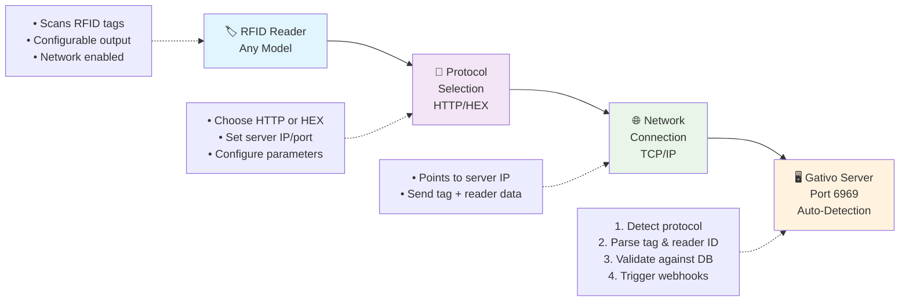

# Gativo - Universal RFID TCP Server

A lightweight, modular Node.js server for processing RFID tag data via TCP connections. Supports both **HTTP and HEX protocols** from RFID readers, validates tags against a remote database, and triggers webhooks for approved tags with built-in debounce protection.

## 🚀 Features

- **Dual Protocol Support** - HTTP GET requests and HEX binary (STX/ETX) protocols
- **Universal Compatibility** - Works with any RFID reader (TCP/HTTP capable)
- **TCP Server** - Receives RFID data on configurable port 6969
- **Reader Identification** - Tracks reader serial numbers for multi-location setups
- **Tag Validation** - 1:1 exact matching against remote approved tags database  
- **Webhook Triggers** - HTTP GET requests to configured endpoints for approved tags
- **Heartbeat Support** - Handles reader keep-alive requests gracefully
- **Debounce Protection** - Prevents duplicate triggers within configurable time window
- **Auto-Refresh** - Periodically updates approved tags from remote endpoint
- **Memory Management** - Automatic cleanup of old tracking records
- **Error Resilience** - Graceful error handling and recovery
- **Modular Design** - Clean, maintainable architecture with single responsibility modules

## 📁 Project Structure

```
├── rfid-server.js          # Main server entry point
├── rfid-server-old.js      # Original monolithic version (backup)  
├── server.py              # Original Python implementation
├── package.json           # Dependencies and scripts
├── .env                   # Environment configuration
└── src/                   # Modular components
    ├── config.js          # Environment configuration management
    ├── network-utils.js   # Network utilities (IP detection, client formatting)
    ├── http-client.js     # HTTP client for API calls
    ├── http-protocol.js   # HTTP GET request parsing
    ├── debounce-manager.js # Tag debouncing logic
    ├── rfid-protocol.js   # STX/ETX binary protocol parsing
    └── tag-database.js    # Approved tags database management
```

## ⚡ Quick Start

### Installation

```bash
# Clone the repository
git clone <repository-url>
cd gativo

# Install dependencies
npm install

# Configure environment
cp .env.example .env
# Edit .env with your endpoints
```

### Configuration

Set these environment variables in `.env`:

```env
# Required endpoints
TAGS_DB_ENDPOINT="https://api.example.com/approved-tags"
TRIGGER_ENDPOINT="https://api.example.com/tag-detected"  

# Reader Protocol Configuration
READER_PROTOCOL="HTTP"                   # HTTP or HEX - choose based on your reader
# HTTP: For readers that send GET requests with readsn and id parameters
# HEX:  For readers that send binary data with STX/ETX protocol markers

# Default approved tags (merged with endpoint + used as fallback)
DEFAULT_APPROVED_TAGS=["1234567890", "0987654321"]

# Tag database auto-update configuration
TAGS_DB_AUTOUPDATE=true                  # true/false - enable/disable auto-refresh
TAGS_DB_UPDATE_FREQUENCY=5               # minutes - how often to refresh from endpoint

# Timing configuration (optional - defaults shown)
DEBOUNCE_MINUTES=5
REQUEST_TIMEOUT_SECONDS=5
```

## 📡 Reader Setup & Configuration

### Protocol Selection

Gativo supports **two communication protocols** depending on your RFID reader:

- **HTTP Protocol**: Readers that send HTTP GET requests (modern TCP/IP readers)
- **HEX Protocol**: Readers that send binary data with STX/ETX markers (traditional serial-over-TCP)

## 🛠️ Hardware Compatibility

### Tested RFID Readers

Gativo has been specifically tested and verified to work with:

#### **GEE-UR-E901 E Series UHF Reader** ✅ **TESTED**


**Specifications:**
- **Model**: [GEE-UR-E901 E series 9 dBi UHF RFID reader](https://www.geenfc.com/en/Products/UHFReader/eseries/2023-08-30/335.html)
- **Read Range**: Up to 15 meters  
- **Frequency**: 865-868 MHz (EU) / 902-928 MHz (US)
- **Protocol Support**: HTTP and HEX compatible
- **Connectivity**: RJ45 Ethernet, WiFi, RS232, RS485, USB
- **Power Output**: 0-30 dBm adjustable
- **Standards**: ISO18000-6C RFID compliant

**Why This Reader Works Well:**
- ✅ **Native TCP/IP support** via RJ45 Ethernet connection
- ✅ **NodeJS SDK available** from manufacturer  
- ✅ **Configurable protocols** - supports both HTTP and HEX modes
- ✅ **Long range** - up to 15m read distance with built-in antenna
- ✅ **Industrial grade** - robust PVC enclosure (256×256×88mm)
- ✅ **Multi-interface** - flexible connection options

### Universal Compatibility

While tested specifically with the GEE-UR-E901, Gativo works with **any RFID reader** that supports:
- **TCP/IP connectivity** (Ethernet, WiFi, or serial-over-TCP)
- **HTTP GET requests** OR **Binary STX/ETX protocol**
- **Configurable server endpoints** (IP address and port settings)

### Hardware Connection Flow



### Reader Configuration Screenshots

Configure your RFID reader based on the protocol it supports:

#### Option 1: HTTP Protocol Readers
For readers that support HTTP GET requests (recommended for new setups):


**HTTP Protocol sends:**
```
GET readsn=READER123&id=TAG456789 HTTP/1.1
```

#### Option 2: HEX Protocol Readers  
For readers that send binary STX/ETX data (legacy/serial readers):


**HEX Protocol sends:**
```
[STX][TAG_DATA][ETX] # Binary format
```

#### Basic Network Settings
Both protocols use the same network configuration:


#### Parameter Settings  
Set up the basic communication parameters:


### Setup Steps

1. **Choose Protocol** - Determine if your reader supports HTTP or HEX protocol
2. **Configure Environment** - Set `READER_PROTOCOL="HTTP"` or `READER_PROTOCOL="HEX"` in `.env`
3. **Connect Reader** - Connect RFID reader to your network
4. **Configure Network** - Set server IP address and port 6969 in reader settings
5. **Set Protocol Mode** - Choose HTTP or HEX in reader's advanced settings
6. **Test Connection** - Verify reader can reach server IP/port
7. **Start Server** - Run `npm start` to begin receiving tag data

### Protocol-Specific Configuration

#### For HTTP Protocol:
- Set reader to send HTTP GET requests
- Enable `readsn` (reader serial) and `id` (tag) parameters
- Server auto-detects and parses HTTP format
- Handles heartbeat requests gracefully

#### For HEX Protocol:
- Set reader to send binary STX/ETX data
- Configure start byte (STX: 0x02) and end byte (ETX: 0x03)
- Server auto-detects and parses binary format
- Processes tag data between control bytes

### Troubleshooting

- **Connection Failed**: Check network connectivity between reader and server
- **No Tag Data**: Verify correct protocol is selected (HTTP vs HEX) in both reader and `.env`
- **Wrong Port**: Ensure reader is configured to send data to port 6969
- **IP Issues**: Confirm server IP address matches reader configuration
- **Protocol Mismatch**: Check reader sends data in expected format (HTTP GET vs binary STX/ETX)
- **Heartbeat Errors**: HTTP readers may send keep-alive requests - these are handled automatically

### Running

```bash
# Start the server
npm start

# The server will display:
# 🚀 RFID Server listening on 192.168.x.x:6969
# � Reader protocol: HTTP (or HEX)
# �📊 Loaded X approved tags
# ⏱️  Tag debounce set to 5 minutes
```

## 🔧 How It Works

### Tag Database Management
- **Default Tags** - Loaded from `DEFAULT_APPROVED_TAGS` at startup
- **Auto-Update** - Configurable refresh from endpoint (on/off + frequency)
- **Smart Merging** - Remote tags merged with defaults on each update  
- **Fallback Protection** - Uses defaults if endpoint fails or is unavailable
- **Exact Matching** - Only accepts perfect 1:1 tag ID matches

### Processing Pipeline
1. **TCP Connection** - RFID readers connect to port 6969
2. **Protocol Detection** - Server auto-detects HTTP or HEX based on configuration
3. **Data Parsing** - Extracts tag IDs and reader serial numbers from appropriate format
4. **Tag Validation** - Checks if tag exists in approved database (exact match)
5. **Debounce Check** - Prevents duplicate triggers within time window
6. **Webhook Trigger** - Makes GET request to configured endpoint for approved tags

### Protocol Examples

#### HTTP Protocol Flow
```
🔌 Connected: 192.168.1.50:12345
💻 HTTP Request: GET readsn=READER123&id=ABC123456789 HTTP/1.1
🏷️  ABC123456789 (Reader: READER123)
✅ APPROVED TAG DETECTED: ABC123456789
🚀 Triggering endpoint for approved tag: ABC123456789
✅ Trigger response (200): {"success": true, "tag_id": "ABC123456789"}
--break--

💻 HTTP Request: GET readsn=READER123&heart=1 HTTP/1.1
💓 Heartbeat from reader: READER123
--break--
```

#### HEX Protocol Flow  
```
🔌 Connected: 192.168.1.50:12345
🔢 HEX Data: [0x02][ABC123456789][0x03] 
🏷️  ABC123456789 (Reader: hex-reader)
✅ APPROVED TAG DETECTED: ABC123456789
🚀 Triggering endpoint for approved tag: ABC123456789
✅ Trigger response (200): {"success": true, "tag_id": "ABC123456789"}
--break--
```

## 🌐 API Integration

### Approved Tags Endpoint

Your `TAGS_DB_ENDPOINT` should return a JSON array:

```json
["TAG001", "TAG002", "ABC123456789", "DEF987654321"]
```

### Trigger Endpoint

When an approved tag is detected, a GET request is made:

```
GET https://api.example.com/tag-detected?tag=ABC123456789
```

## 🛠️ Development

### Module Overview

- **`config.js`** - Centralized environment configuration
- **`network-utils.js`** - IP detection and client address formatting
- **`http-client.js`** - HTTP requests with timeout and error handling
- **`debounce-manager.js`** - Tag timing logic and cleanup
- **`rfid-protocol.js`** - STX/ETX binary protocol parsing
- **`tag-database.js`** - In-memory approved tags management

### Code Examples

```javascript
const config = require('./src/config');
const tagDatabase = require('./src/tag-database');

// Get server configuration
console.log(config.server.port); // 6969

// Check if tag is approved
console.log(tagDatabase.isApproved('TAG001')); // true/false

// Get database stats
console.log(tagDatabase.getStats());
```

### Testing with Old Version

```bash
# Run simplified version (default)
npm start

# Run original monolithic version for comparison  
npm run start:old
```

## 🏗️ Architecture Benefits

- **Lean & Fast** - Only essential features, ~490 lines total
- **Single Responsibility** - Each module has one clear purpose
- **Maintainable** - Easy to modify specific functionality  
- **Testable** - Modules can be unit tested in isolation
- **Production Ready** - Error handling, graceful shutdown, memory management

## 📊 Performance

- **Memory Efficient** - In-memory Set for O(1) tag lookups
- **Auto-Cleanup** - Removes old debounce records every 10 minutes
- **Minimal Dependencies** - Only `dotenv` required
- **Low Latency** - Direct TCP connections, no HTTP overhead

## 🔒 Production Deployment

### Environment Variables

```env
# Required
TAGS_DB_ENDPOINT="https://your-api.com/approved-tags"
TRIGGER_ENDPOINT="https://your-api.com/tag-detected"

# Optional
DEBOUNCE_MINUTES=5  # Default: 5 minutes
```

### Process Management

```bash
# Using PM2 (recommended)
npm install -g pm2
pm2 start rfid-server.js --name "gativo-rfid"
pm2 startup
pm2 save

# Using systemd
sudo systemctl enable gativo-rfid.service
sudo systemctl start gativo-rfid.service
```

### Monitoring

The server provides detailed console logging for monitoring:

```
🚀 RFID Server listening on 192.168.1.100:6969
📋 Loading approved tags database...
✅ Loaded 42 approved tags
🔌 Connected: 192.168.1.50:12345
🏷️  ABC123456789
✅ APPROVED TAG DETECTED: ABC123456789
🚀 Triggering endpoint for approved tag: ABC123456789
```

## 🤝 Contributing

1. Fork the repository
2. Create a feature branch (`git checkout -b feature/amazing-feature`)
3. Commit your changes (`git commit -m 'Add amazing feature'`)
4. Push to the branch (`git push origin feature/amazing-feature`)
5. Open a Pull Request

## 📝 License

This project is licensed under the MIT License - see the [LICENSE](LICENSE) file for details.

## 🆚 Evolution

This project evolved from:
- **Python TCP Server** (`server.py`) - Original implementation
- **NestJS Version** (removed) - Over-engineered framework approach  
- **Monolithic Node.js** (`rfid-server-old.js`) - Single file version
- **Modular Node.js** (`rfid-server.js`) - Current clean architecture

The current version provides the same functionality with better maintainability and significantly reduced complexity.
